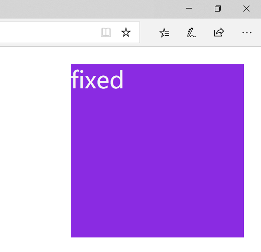

# css的display属性
css中的display属性值有：**none**、**block**、**inline**、**inline-block**、**table**、**list-item**等等，在这里介绍一下常用的属性。
### none属性
用法：
```
diaplay:none;
```
当一个元素的display属性被设置为none后，该元素将不会显示，这里要与**visible:hidden**相区别，**display:none**是指该元素在页面上彻底消失，不会保留其位置，而**visible:hidden**则还会使元素在页面占据空间，但是占据的空间处不显示该元素。

### block、inline、inline-block属性
**block、inline、inline-block**是我们比较常见的三种属性，要想具体了解这三种属性，首先我们要先了解一下html中的**块级元素**和**行内元素**：

**块级元素**  
1. 总是从新的一行开始
2. 高度、宽度都是可控的
3. 宽度没有设置时，默认为100%
4. 块级元素中可以包含块级元素和行内元素

**行内元素**   
1. 和其他元素都在一行
2. 高度、宽度以及内边距都是不可控的
3. 宽高就是内容的高度，不可以改变
4. 行内元素只能行内元素，不能包含块级元素

而在这里，我们的**inline**属性就对应着**行内元素**，**block**属性就对应着**块级元素**，而**inline-block**属性则是指让一个元素即有这行内元素的**与其他元素在一行**，又有着**块级元素**的**可以设置高度宽度以及包含块级元素和行内元素的属性**，下面我们用代码测试一下：  
```
<div style="display: inline;width: 300px;height: 300px;background-color: cornflowerblue">第一个div块</div>
<div style="display: inline-block;width: 300px;height: 300px;background-color: lightyellow">第二个div块</div>
```
运行结果：

我们可以看到块级元素div被转换成了行级元素，在这里我们要注意的是：
-第一个div块被转换成了行内元素，即使我们给它设定了宽高，它也没有按照我们预想的显示，这与行内元素的性质是一致的。而设置成**Inline-block**的div既没有换行也没有被限制宽高，所以我们可以利用这个特点来完成一些布局。
同理我们也可以测试行级元素变为块级元素，代码如下：
```
<span style="display: block">测试内联元素变块级元素</span>
<span>测试内联元素变块级元素</span>
```
  
可见两个span并不在一行，说明我们给第一个span设置的**display:block**起了作用。

## table属性
除了以上三种常见的以外，display属性还有另外一个很有用的属性值:**display:table**及相关的属性值，其实display:table与我们html中的table标签很像，我们总结出这样的结论：
- display:table  相当于“table”标签； 
- display:table-row  相当于“tr”标签； 
- display:table-cell  相当于“td”标签；

除此之外还有其他的属性的图片](https://upload-images.jianshu.io/upload_images/11200005-dcfd5244b6907da2.png?imageMogr2/auto-orient/strip%7CimageView2/2/w/1240)

# css中的position属性
position属性用来规定元素的定位类型，取值有：**absolute、fixed、relative、static**。
## 相对定位relative
在使用相对定位时，无论元素是否移动，元素在文档流中占据原来空间，只是表现会改变。
```
<div style="height: 100px; width: 100px; background-color: red;"></div>
<div style="height: 100px; width: 100px; background-color: green; position:relative; top:20px; left:20px;"></div>
<div style="height: 100px; width: 100px; background-color: red;"></div>
```
效果如图：


## 绝对定位absolute
绝对定位使元素的位置与文档流无关，也不占据文档流空间。绝对定位的元素的位置是相对于距离他最近的非static祖先元素位置决定的。如果元素没有已定位的祖先元素，那么他的位置就相对于（body或html之类的）元素进行定位。
```
<div style="height: 100px; width: 100px; background-color: red;"></div>
<div style="height: 100px; width: 100px; background-color: yellow; position:absolute; top:20px; left:20px;"></div>
<div style="height: 100px; width: 100px; background-color: green;"></div>
```
效果如图：

## 固定fixed
fixed的效果是能让使用该定位的元素固定在窗口中的某个位置，不会受窗口滚动条的影响。
```
<div style="width: 300px;height: 300px;position: fixed;right: 30px;background-color: blueviolet;top:30px;">
<span style="font-size: 40px;color: whitesmoke">fixed</span>
</div>
```
效果如图：  
应用多类似于网页上弹出的小广告